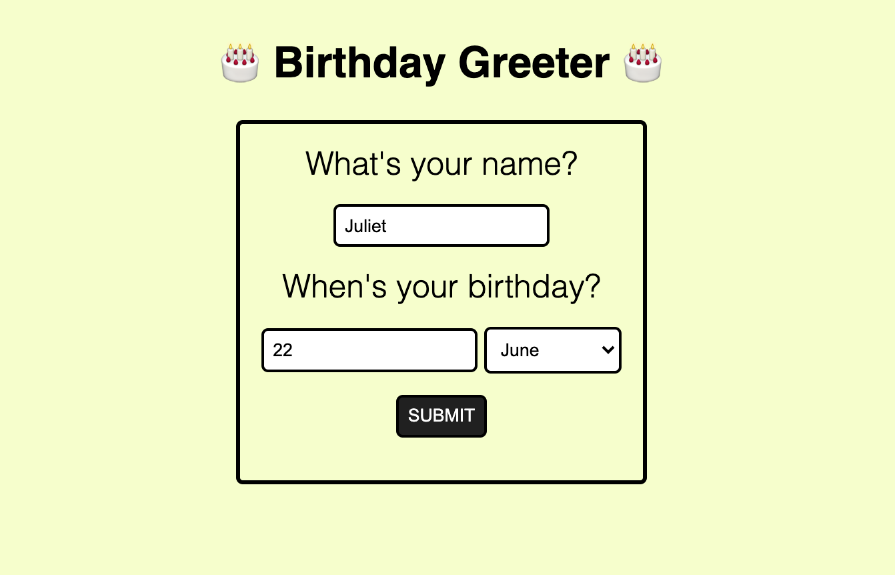
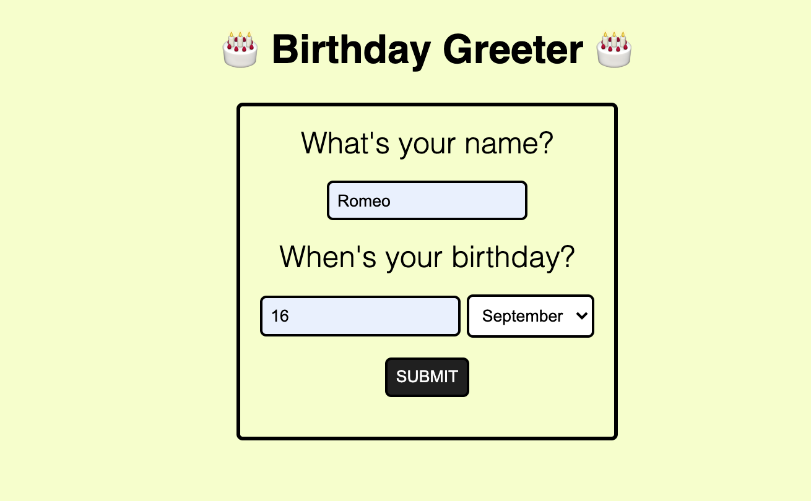

### Birthday Greeter app

Built my own birthday greeter application from scratch, without a walk-through.

When the user submits the form, and depending on the current date, the app will either:

- wish the user happy birthday
- tell them how long they'll have to wait until their next birthday

#### Screenshots

